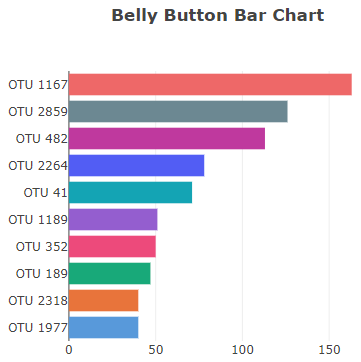
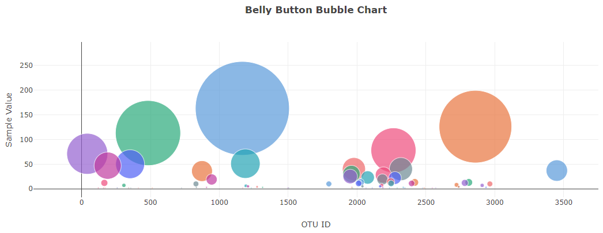
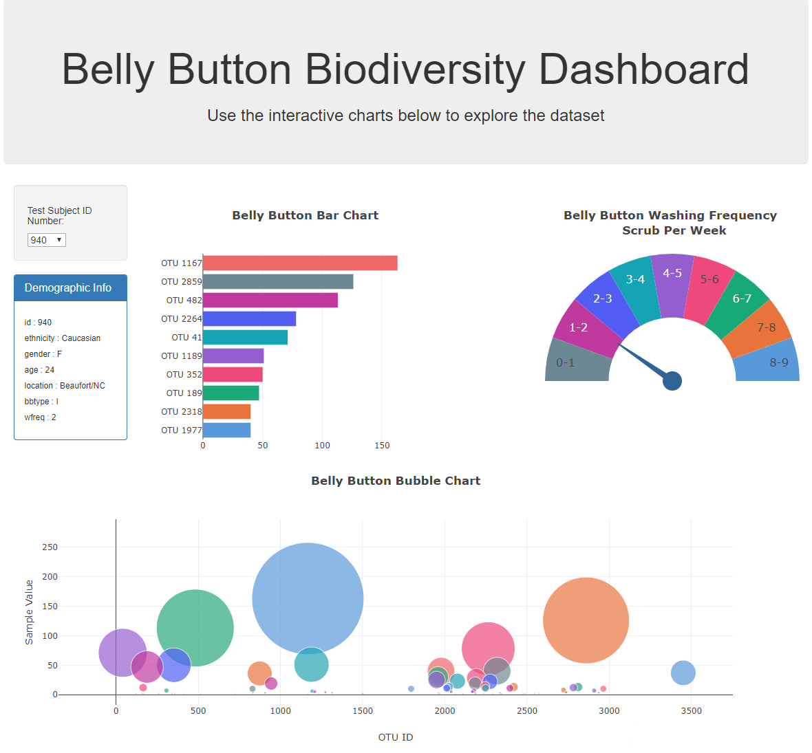
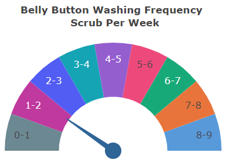

# 
  

# Plot.ly - Belly Button Biodiversity

# 
  

In this project, I built an interactive dashboard to explore the [Belly Button Biodiversity dataset](http://robdunnlab.com/projects/belly-button-biodiversity/ "NC State's Public Science Lab"), which catalogs the microbes that colonize human navels.

The dataset reveals that a small handful of microbial species (also called operational taxonomic units, or OTUs, in the study) were present in more than 70% of people, while the rest were relatively rare.

## Step 1: Plotly

1. Use the D3 library to read in `samples.json`.

2. Create a horizontal bar chart with a dropdown menu to display the top 10 OTUs found in that individual.

    * Use `sample_values` as the values for the bar chart.

    * Use `otu_ids` as the labels for the bar chart.

    * Use `otu_labels` as the hovertext for the chart.

# 
  

3. Create a bubble chart that displays each sample.

    * Use `otu_ids` for the x values.

    * Use `sample_values` for the y values.

    * Use `sample_values` for the marker size.

    * Use `otu_ids` for the marker colors.

    * Use `otu_labels` for the text values.

4. Display the sample metadata, i.e., an individual's demographic information.

5. Display each key-value pair from the metadata JSON object somewhere on the page.

6. Update all of the plots any time that a new sample is selected.

Additionally, I created a layout for my dashboard:

## Additional Plot

* I adapted the Gauge Chart from [Plotly](https://plot.ly/javascript/gauge-charts "Plot.ly") to plot the weekly washing frequency of the individual.

* Next, I modifed the example gauge code to account for values ranging from 0 through 9.

* Update the chart whenever a new sample is selected.

# 
  

## Deployment

Deploy my app to a free static page hosting service, GitHub Pages.

## Tips

* Using `console.log` inside of my JavaScript code helped numerous times to see what the data looked like at each step.

- - -
## Tools Used

* Plot.ly
* Javascript
* HTML
* CSS
* Json
* D3.js
* GitHub and GitHub Pages
* console.log

- - -
## Author

* **Michael R. Davis** - **[Davis1776](https://github.com/Davis1776 "GitHub for Michael Davis)**

## Acknowledgments

* Data Source: Hulcr, J. et al.(2012) _A Jungle in There: Bacteria in Belly Buttons are Highly Diverse, but Predictable_. Retrieved from: [http://robdunnlab.com/projects/belly-button-biodiversity/results-and-data/](http://robdunnlab.com/projects/belly-button-biodiversity/results-and-data/ "NC State's Robdunn Lab")
* [Plotly.js documentation](https://plot.ly/javascript/ "Plot.ly") was used to help build the plots.
* [Butler University Data Analytics and Visualization Executive Education program](https://www.butler.edu/executive-education "Butler University Executive Education homepage") and instructors for assistance.
* Hat tip to Triology Education Services for providing the challenge guidelines.

## Copyright
Michael R. Davis © 2020. All Rights Reserved.